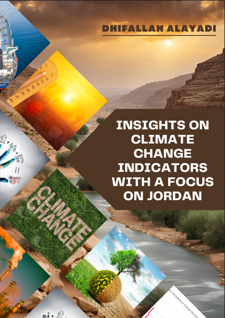

# Climate Change Indicators Analysis



## Table of Contents
- [Project Overview](#project-overview)
- [Dataset](#dataset)
- [Project Components](#project-components)
  - [Kaggle Notebook](#kaggle-notebook)
  - [Streamlit Dashboard](#streamlit-dashboard)
  - [PDF Report](#pdf-report)
- [Methodology](#methodology)
- [Key Findings](#key-findings)
- [Installation](#installation)
- [Usage](#usage)
- [Contributors](#contributors)
- [Contact](#contact)

## Project Overview
This project focuses on analyzing climate change indicators with a specific emphasis on temperature changes from 1961 to 2020. By examining data from various countries, particularly Jordan, this project aims to provide insights into global and regional temperature trends, the impact on different continents, and the differences between urban and rural areas. Additionally, the analysis extends to G7 countries and presents a statistical summary and correlation analysis of temperature changes.

## Dataset
The primary dataset used for this analysis is the [Climate Change Indicators Dataset](https://www.kaggle.com/datasets/tarunrm09/climate-change-indicators) available on Kaggle. This dataset includes temperature change data from various countries, covering the period from 1961 to 2020.

## Project Components

### Kaggle Notebook
The Kaggle Notebook provides a detailed analysis of the climate change indicators dataset. It includes data cleaning, preparation, and various visualizations to present the findings.

- [Kaggle Notebook - Climate Change Indicators](https://www.kaggle.com/code/dhifallhalayadi/climate-change-indicators)

### Streamlit Dashboard
The Streamlit Dashboard offers an interactive way to explore the dataset and visualizations. It includes sections such as:
- Introduction
- Data Sources and Methodology
- Overview of Global Trends
- Temperature Change Comparison
- Trend Analysis
- Regional Analysis
- Country-Specific Analysis
- Urban vs. Rural Trends
- G7 Analysis
- Statistical Analysis
- Conclusions

### PDF Report
A comprehensive PDF report summarizing the findings and insights from the analysis.

- [PDF Report](https://www.canva.com/design/DAGKe3b3eSA/1zJMFyncNlI8nyuH9GKHKg/edit?utm_content=DAGKe3b3eSA&utm_campaign=designshare&utm_medium=link2&utm_source=sharebutton)

## Methodology
The methodology involves the following steps:
1. **Data Cleaning and Preparation**: Handling missing values, standardizing country names, and categorizing countries into urban and rural classifications.
2. **Exploratory Data Analysis (EDA)**: Visualizing global temperature trends, identifying the top 10 warmest and coldest years, and comparing temperature changes in Jordan with global averages.
3. **Statistical Analysis**: Calculating statistical summaries and correlations.
4. **Visualization**: Creating interactive plots using Plotly and presenting them in a Streamlit dashboard.

## Key Findings
- **Global Trends**: An upward trend in global temperatures, indicating an increase in average temperatures over time.
- **Jordan's Temperature Trends**: Jordan's temperature trends align with global patterns, showing increasing temperatures.
- **Urban vs. Rural Trends**: Urban areas tend to experience higher temperature changes compared to rural areas.
- **G7 Countries**: Varied temperature trends among G7 countries, highlighting the need for region-specific climate actions.

## Installation
To set up the project locally, follow these steps:

1. Clone the repository:
   ```sh
   git clone https://github.com/yourusername/climate-change-indicators.git
   cd climate-change-indicators
2. Create a virtual environment and activate it:
python -m venv venv
source venv/bin/activate  # On Windows, use `venv\Scripts\activate`
3. pip install -r requirements.txt

## Usage
To run the Streamlit dashboard, use the following command:
`streamlit run app.py`

## Contributors
- ** DhifAllah Alayadi **

## Contact
- **Email**: dhifalayadi@gmail.com
- **LinkedIn**: [linkedin.com/in/Alayadi](https://www.linkedin.com/in/Alayadi)
- **DataCamp**: [DataCamp Profile](https://www.datacamp.com/portfolio/alayadidhif)
- **Tableau**: [Tableau Public Profile](https://public.tableau.com/app/profile/dhifallah/vizzes)
